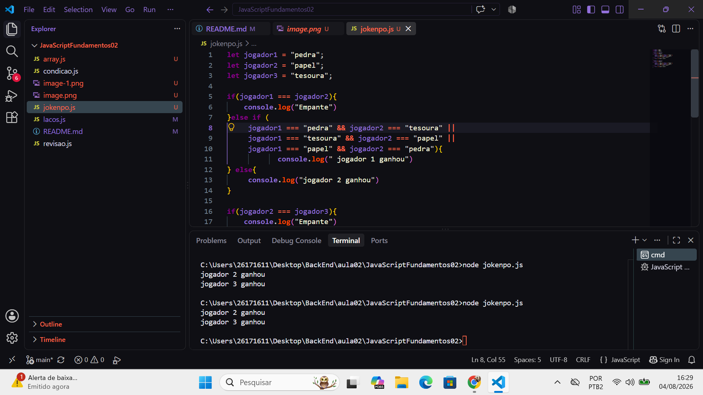

# JavaScript - Consições e Laços de Repetição 

## Objetivo

Ao final dessa aula, aluno sera capaz de:

* Compreender como funciona estruturas condicionais. 
* Utilizar operadores de comparação e operadores lógicos.
* Desenvolver algoritimos utilizando `if`, `else` e `else if`.
* Utilizar a estrutura `switch`
* Criar repetições utilizando `for`, `while ` e `do...while`.
* Resolver problema utilizando logistica de porgramação.

---

## Conteudo 

### Estruturas condicionais 

* if
* else
* else if
* switch
* operadores de comparação
* Operadores logicos 

### Laços de Repetição

* for 
* while
* do...while
* break
* continue 

### Arrays

* puch() Adiciona ao final
* pop() remove o ultimo 
* unshift() Adiciona ao inicio 
* shift () romove o primeiro 
* length quantidade de elementos 
* at () Acessa uma posição 

## Como executar

```bash
   git clone https://github.com/felipepacheco-star/JavaScriptFundamentos02.git
```

Entre na pasta 
```bash
  cd JavaScriptFundamentos02
```


Execute qualquer arquivo JavaScript
```
  bash
```


## Exemplos desenvolvidos 

DUrante a aula foram implementados exeplos como:
* verificar Maioridade
* calcular aprovação do aluno.
* classificar idade
* menu utilizando switch
* contagem crescente.
* contagem regressiva.

## Exercicios 

* Estruturar condicionais
* operadores logicos
* estruturas de repetição
* problemas utilizando logica de programação 
* desafio final integrando todos os conceitos estudados.

## Técnologias 

* JavaScript (ES2023).
* Node.js
* Visual Studio Code

## Competencia desenvolvidas

* Logica De Programação 
* Tomada de decião 
* Estruturas Condicionais 
* Organização de algoritimos 
* Resolução de problemas 

## Material de Apoio 

* JavaScript
* Node.js
* MDN web Docs
